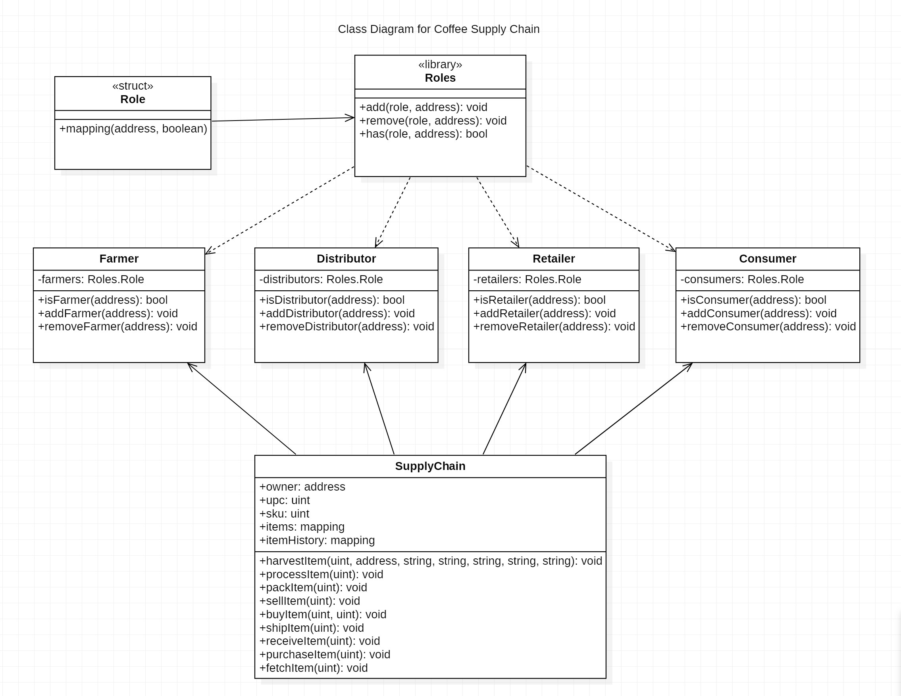

# Supply Chain & Data Auditing

An Ethereum DApp that demonstrates a Supply Chain flow between a Seller and Buyer. The user story is similar to any commonly used supply chain process. A Seller can add items to the inventory system stored in the blockchain. A Buyer can purchase such items from the inventory system. Additionally a Seller can mark an item as Shipped, and similarly a Buyer can mark an item as Received.

## SupplyChain contract

<a href="https://rinkeby.etherscan.io/address/0x39699967A77e89ec6F676648B22f12088Db06da2">Click here</a> to view the SupplyChain contract on etherscan

## The DApp User Interface


## Getting Started

These instructions will get you a copy of the project up and running on your local machine for development and testing purposes. See deployment for notes on how to deploy the project on a live system.

### Prerequisites

Please make sure you've already installed ganache-cli, Truffle and enabled MetaMask extension in your browser.

### Installing

A step by step series of examples that tell you have to get a development environment running

#### Clone this repository:

```
git clone https://github.com/DineshBS44/Product-Supply-Chain
```

Change directory to `supply-chain` folder and install all requisite npm packages (as listed in `package.json`):

```
cd supply-chain
npm install
```

#### Launch Ganache:

```
ganache-cli -m "<Seed Phrase>"
```

or

```
truffle develop
```

#### Your terminal should look something like this:


#### In a separate terminal window, Compile smart contracts:

```
truffle compile
```

#### Your terminal should look something like this:


This will create the smart contract artifacts in folder `build\contracts`.

Migrate smart contracts to the locally running blockchain, ganache-cli:

```
truffle migrate
```

Or, Migrate smart contracts to the Rinkeby Test Network:

```
truffle migrate --reset --network rinkeby
```

#### Your terminal should look something like this:


#### Test smart contracts:

```
truffle test
```

All 10 tests should pass.


In a separate terminal window, launch the DApp:

```
npm run dev
```

## Built With

- [Ethereum](https://www.ethereum.org/) - Ethereum is a decentralized platform that runs smart contracts
- [IPFS](https://ipfs.io/) - IPFS is the Distributed Web | A peer-to-peer hypermedia protocol
  to make the web faster, safer, and more open.
- [Truffle Framework](http://truffleframework.com/) - Truffle is the most popular development framework for Ethereum with a mission to make your life a whole lot easier.

## Libraries/services used

- **ganache-cli** - For running a local blockchain mostly used for testing purposes
- **dotenv** - For managing data in .env files
- **truffle-hdwallet-provider** - Used to create a provider using Seed phrase(Mnemonic) and Infura RPC URL to connect to the Rinkeby Test Network
- **web3** - To interact with the deployed smart contract either on Ganache or Rinkeby test network
- **mocha & chai** - To test the smart contracts written in solidity
- **lite-server** - To host the DApp on the server
- **Remix** - To compile, deploy and test smart contracts on the Javascript VM
- **Metamask** - Ethereum wallet which is connected to the DApp
- **Infura** - For getting the API endpoint to connect to the Etherem network without having to run a full node
- **IPFS** - To make the DApp completely decentralized, the DApp and all its files are hosted to IPFS
- **Truffle** - Framework used to write, compile, test and deploy smart contracts with ease along with the frontend of the DApp.

## Commands in IPFS to host the project to IPFS

Make sure IPFS-cli is installed

##### Add all the files to IPFS using the command

`ipfs add -r Product-Supply-Chain`

Now the whole project can be view using this <a href="https://ipfs.io/ipfs/QmPyFrunbqj6phRjcggeVUeZLkKeK5695Sw4h3awFDBPet">link</a>
The IPFS hash used to store the project folder is QmPyFrunbqj6phRjcggeVUeZLkKeK5695Sw4h3awFDBPet

##### To publish the DApp to incorporate changes to be viewed using the same hash, the commands used are

`ipfs daemon`

In an different terminal window, execute the following command to publish

`ipfs name publish QmPyFrunbqj6phRjcggeVUeZLkKeK5695Sw4h3awFDBPet`

Use https://gateway.ipfs.io/ipfs/QmRE7NhPk8Db9uNvicKkvy74EuHm9Xkh3JFXspioiCkUiW to see the published project on IPFS

### Additional details

The `transaction hash` and `contract address` for the smart contracts deployed to the Rinkeby Test Network are

##### FarmerRole.sol

- **transaction hash** - 0x47f087866be87e3f5e5232e524fe8102d7dbf0d4e87d0fc68b590b9b4b424ee2
- **contract address** - 0xc3b959344E0938Fd4B7eF71bf085fd00c43DF4aC

##### DistributorRole.sol

- **transaction hash** - 0x346f8b664014de749cb068402099817a09ee576fcb7a6693d2db0a2af9c1720a
- **contract address** - 0x12659187f515EA55f3F37Ae8B894aA5D37853e77

##### RetailerRole.sol

- **transaction hash** - 0x89aabdbdd0a01ef27d536f938bbc99cb824fb237ee5a03bab883218579bc9d92
- **contract address** - 0x36175e8E9707FB14276a43cFA427EC979F5BF85d

##### ConsumerRole.sol

- **transaction hash** - 0xa419d6378791e2f3cb2f68f32d5a449844f4a9683e1ac6bc6e8f14ceda1055e4
- **contract address** - 0xbe969002136306777736D05923268A34ef3AFe7C

##### SupplyChain.sol

- **transaction hash** - 0x1a7c910e8675c97f3dbc348b5e42ecdb2b655c534e66f23b81a7f9df077d093b
- **contract address** - 0x39699967A77e89ec6F676648B22f12088Db06da2

### Some versions of Frameworks and Libraries used in this project are

- **Truffle version** - 5.3.14
- **Solidity version** - 0.8.6
- **Node JS version** - 14.16.1
- **truffle-hdwallet-provider version** - 1.0.17
- **web3 version** - 1.4.0

### An example Transaction History

A product has been tracked through the supply chain and these transactions can be viewed on <a href="https://rinkeby.etherscan.io/">rinkeby.etherscan.io</a>

The Transaction hashes are

- **Harvested** - 0x39804614f7166254315d2a8c419ecec42138aa565bc86b8e5b1f0f402d3821c0
- **Processed** - 0xf1165918be24297b7608bda6ba07a97a26e8455e8a83f5d915b9a5e6b04e7c32
- **Packed** - 0xf26eed8cc3c09150fb95f17f4302154f04581104fe51bbb1eebddd302406dd7a
- **ForSale** - 0xc71c1a414f7ea5396f0bc208bf578c9312f29c3c62103fa5b2576266509ea617
- **Sold** - 0xa2f09593f92c9ad60d5e43a04a5169a3ddadd19aaf6279fe5f5ef6ced08d6e31
- **Shipped** - 0x02c8c1dc6a9b7bfc3e7c158282a885f80781334c043a918e021f44b04c7c37da
- **Received** - 0xf956d27c4d964e9681be3d821c1d50e8186cad80c21085efbd79d37cc1548ea2
- **Purchased** - 0x64d1b162cda79fad3fc74768e171322adb32f86cacf13be580100dd9616fce2f

## UML Diagrams for Coffee Supply Chain




## Developer

<table>
<tr align="center">
<td>
Dinesh B S
<p align="center">

</p>
<p align="center">
<a href = "https://github.com/DineshBS44"></a>
<a href = "https://www.linkedin.com/in/dinesh-b-s-197983192/">

</a>
</p>
</td>
</tr>
  </table>

## License

Licensed under MIT License : https://opensource.org/licenses/MIT

<br>
<br>
